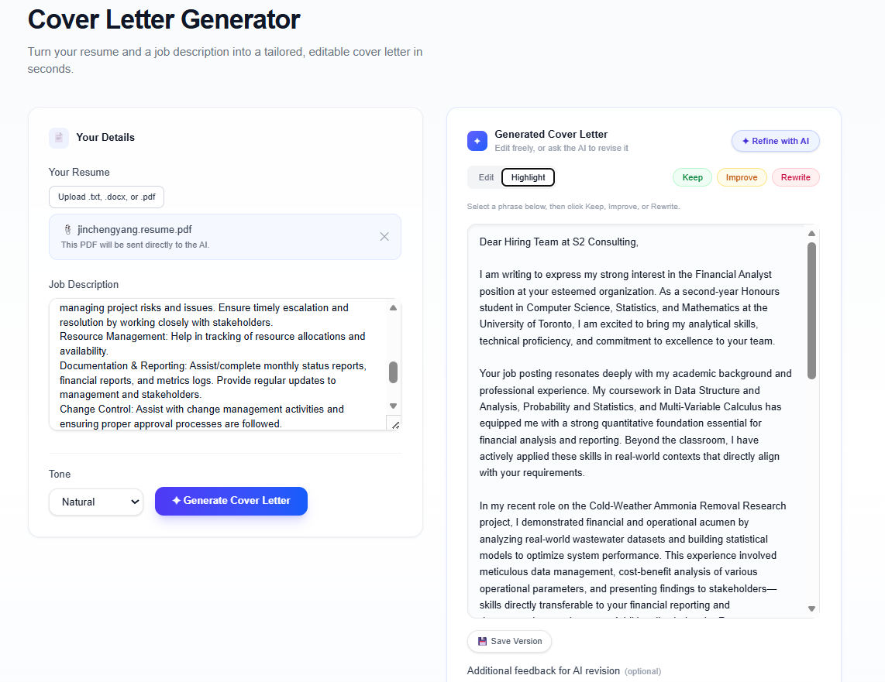
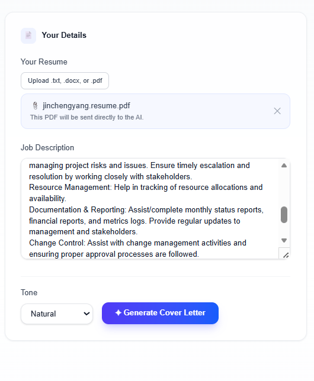
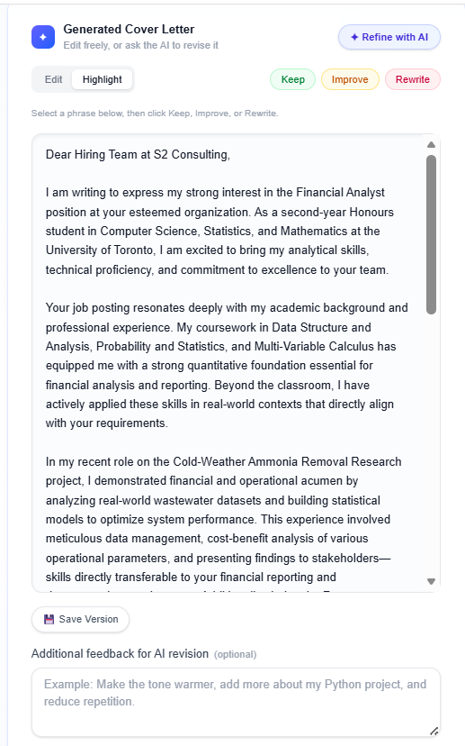
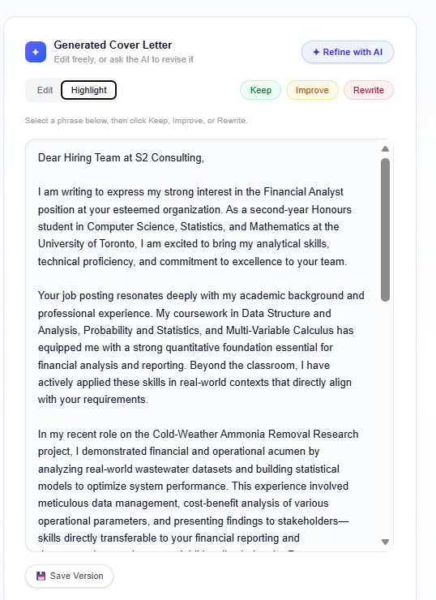

# Cover Letter Agent

**Turn a resume and a job description into a tailored cover letter — then edit, annotate, and refine it with AI, in one workspace.**

Cover Letter Agent is a full-stack web app built with **Next.js**, **TypeScript**, **Tailwind CSS**, and the **Anthropic Claude API**. Instead of a single "generate and hope" button, it treats the cover letter as a living draft: you can rewrite it by hand, tag specific sentences as *Keep / Improve / Rewrite*, leave free-form feedback, and ask an AI assistant to apply changes — with every draft saved to a version history you can step back through.

It's built for job seekers who want a strong first draft fast, without giving up control over the final wording — and as a portfolio project demonstrating a practical, end-to-end integration with the Claude API (including native PDF understanding, prompt construction, and structured user feedback loops).

---

## Product Walkthrough


*The two-panel layout: your inputs on the left, the AI-generated cover letter workspace on the right.*

### 1. Resume & Job Description Input



Paste your resume as plain text, or upload a `.txt`, `.docx`, or `.pdf` file. `.txt` and `.docx` files are parsed in the browser; PDFs are **not** parsed locally — the file is sent directly to Claude, which reads it natively. Paste the target job description, choose a tone (Professional, Natural, Confident, or Concise), and generate.

### 2. AI-Generated Cover Letter Workspace



The generated letter appears in an editable text area — click in and rewrite anything by hand. Below it, an optional **"Additional feedback for AI revision"** note lets you jot down guidance (tone, emphasis, things to cut) to send along with your next AI revision. The **Save Version** button snapshots the current draft into the version history at any time.

### 3. Highlight Feedback: Keep / Improve / Rewrite



Switch to **Highlight** mode, select any phrase or sentence in the letter, and tag it as:
- 🟢 **Keep** — preserve this part as-is
- 🟠 **Improve** — good direction, but tighten or strengthen it
- 🔴 **Rewrite** — replace this part entirely

Tagged phrases are collected below the letter and sent to the AI on your next revision, so the assistant knows exactly which parts to protect and which to change.

### 4. AI Assistant Refinement

Clicking **"Refine with AI"** (visible in the top-right of the workspace screenshot above) opens an instruction panel where you describe what you want changed — e.g. *"make it more concise and lead with my leadership experience."* The assistant rewrites the letter using your instruction, plus any active highlights and additional feedback notes, and returns a new draft in place.

### 5. Version History & Restore

Every generated, AI-refined, or manually saved draft (via **Save Version**) is added to a running version list for the current session, tagged with its source (*Generated*, *Refined*, or *Manual*) and timestamp. You can expand any past version to read it in full and restore it as the active draft.

---

## Features

- **AI-generated cover letters** tailored to a resume + job description, in a tone of your choosing
- **Resume input, two ways** — paste text, or upload `.txt` / `.docx` / `.pdf`
- **Native PDF understanding** — uploaded PDFs are sent directly to Claude rather than parsed client-side
- **Manual editing** — the draft is a plain, fully editable text area
- **Highlight feedback** — tag phrases as Keep / Improve / Rewrite to guide the next revision
- **Free-form revision notes** — add general instructions alongside highlights
- **AI Assistant** — describe a change in plain language and get a revised draft
- **Version history** — track generated, refined, and manually saved drafts, and restore any of them

## Tech Stack

| Layer | Technology |
|---|---|
| Framework | [Next.js](https://nextjs.org/) (App Router) + TypeScript |
| Styling | [Tailwind CSS](https://tailwindcss.com/) |
| AI | [Anthropic Claude API](https://docs.anthropic.com/) via `@anthropic-ai/sdk` (model: `claude-haiku-4-5`) |
| File parsing | [mammoth](https://github.com/mwilliamson/mammoth.js) for client-side `.docx` text extraction |

## Architecture / How It Works

```
┌─────────────────────┐        POST /api/generate-cover-letter        ┌──────────────────────┐
│                      │  (resume text and/or PDF, job description,   │                       │
│   Browser (React)    │───────────────  tone)  ───────────────────▶  │  Next.js API Route    │
│   src/app/page.tsx   │                                               │  (server-side)        │
│                      │◀──────────────  { coverLetter } ─────────────│  calls Claude via     │
└─────────────────────┘                                               │  @anthropic-ai/sdk    │
          │                                                            └──────────┬───────────┘
          │            POST /api/refine-cover-letter                             │
          │   (current draft, instruction, highlights, notes)                    │
          └───────────────────────────────────────────────────────────▶  ANTHROPIC_API_KEY
                                                                          (server env only)
```

1. All UI state (resume text, job description, draft, highlights, version history) lives client-side in React state — there is no backend database.
2. The two API routes (`generate-cover-letter`, `refine-cover-letter`) are the only places that talk to Claude; the API key never leaves the server.
3. When a PDF is uploaded, it's base64-encoded and sent as a `document` content block directly to Claude alongside the prompt — Claude reads the PDF natively rather than the app extracting its text first.
4. Highlights and revision notes are formatted into the prompt sent to `/api/refine-cover-letter`, grouped by Keep / Improve / Rewrite, so the model has explicit, structured guidance rather than free text alone.

## Local Setup

### Prerequisites

- Node.js 18+ and npm (or yarn / pnpm / bun)
- An [Anthropic API key](https://console.anthropic.com/)

### Install

```bash
git clone <this-repo-url>
cd cover-letter-agent
npm install
```

## Environment Variables

Create a `.env.local` file in the project root (this file is git-ignored and must never be committed):

```bash
ANTHROPIC_API_KEY=your-anthropic-api-key-here
```

The key is only ever read on the server, inside API routes, and is never exposed to the browser.

## Running the App

```bash
npm run dev
```

Open [http://localhost:3000](http://localhost:3000) to use the app.

Other available scripts:

```bash
npm run build   # production build
npm run start   # run the production build
npm run lint    # lint the project
```

## API Routes

| Route | Method | Purpose |
|---|---|---|
| `/api/generate-cover-letter` | `POST` | Accepts a resume (text and/or an uploaded PDF file), a job description, and a tone. Sends the resume text and, if provided, the PDF file directly to Claude, and returns a generated cover letter. |
| `/api/refine-cover-letter` | `POST` | Accepts the current draft, a user instruction, and optional highlight feedback / revision notes. Sends everything to Claude and returns a revised cover letter. |

Both routes call the Anthropic Claude API server-side and return JSON in the shape `{ coverLetter: string }` on success, or `{ error: string }` with an appropriate HTTP status (`400`, `401`, `429`, `502`, or `500`) on failure.

## Security Notes

- `ANTHROPIC_API_KEY` is read **only inside server-side API routes** — it is never sent to or exposed in the browser.
- `.env.local` is listed in `.gitignore` and must never be committed to version control.
- When deploying, set the API key through your hosting provider's environment variable configuration rather than hardcoding it anywhere in the repo.

## Current Limitations

- **Version history is client-side only.** Versions live in React state for the current browser session and are lost on page refresh — there is no database or persistent storage yet.
- **File parsing is limited.** `.txt` and `.docx` are parsed in the browser; `.pdf` is sent to Claude without local parsing; `.doc` is not supported.
- No user accounts, authentication, or history saved across sessions.
- No automated tests yet.

## Future Improvements (Planned)

- Persist version history (database or local storage) so drafts survive a page refresh
- Support `.doc` file uploads
- User accounts with saved resumes, job descriptions, and cover letter history
- Export cover letters as PDF or `.docx`
- Automated tests for API routes and core UI flows

## Project Status

🚧 **Work in progress / MVP.** Core generation, manual editing, highlight feedback, and AI-assisted refinement are implemented and working end-to-end. Persistence, accounts, and export are planned but not yet built.
